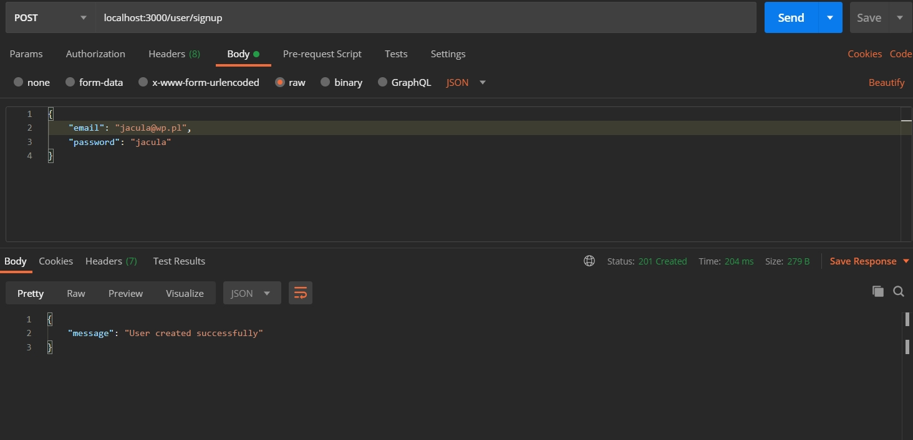
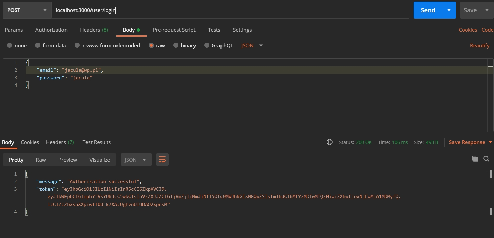
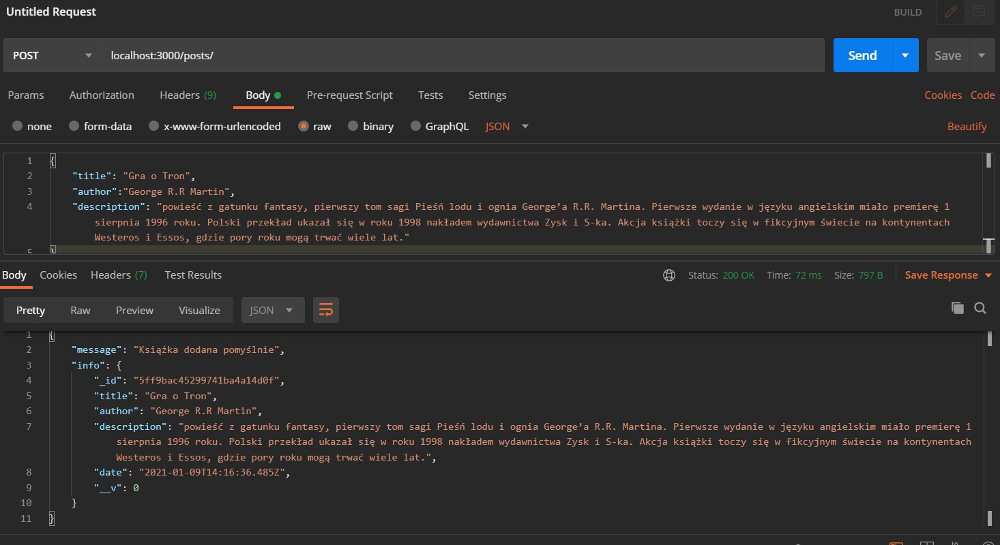
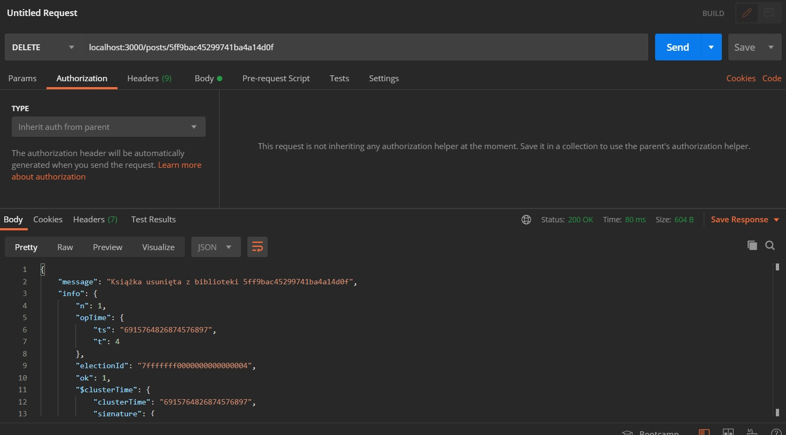
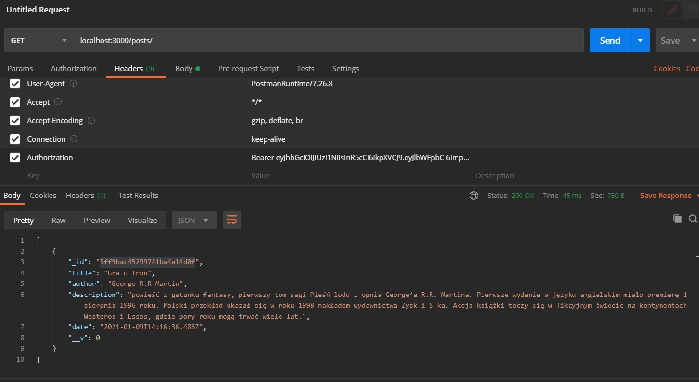
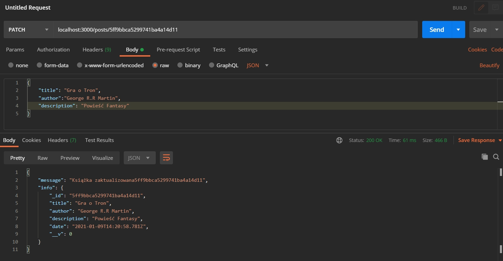

## Library Rest APi 
# Made with Visual Studio Code

# Creating a User

# User Key

# Logging in

# Post

# Delete

# Get

# Patch

# License
[GNU] (https://choosealicense.com/licenses/gpl-3.0/)
